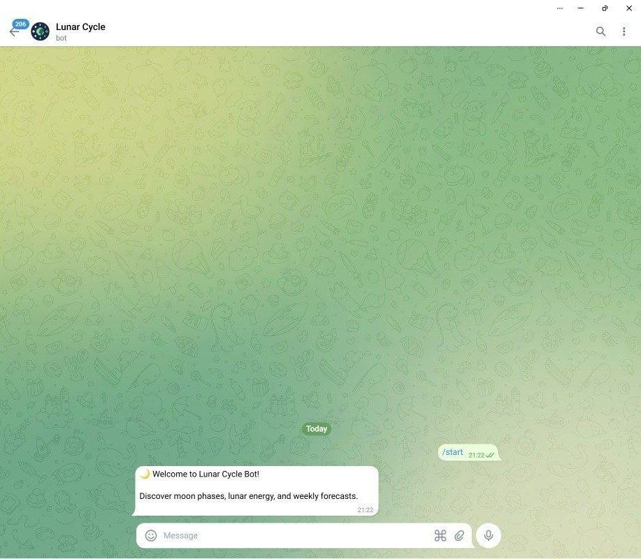
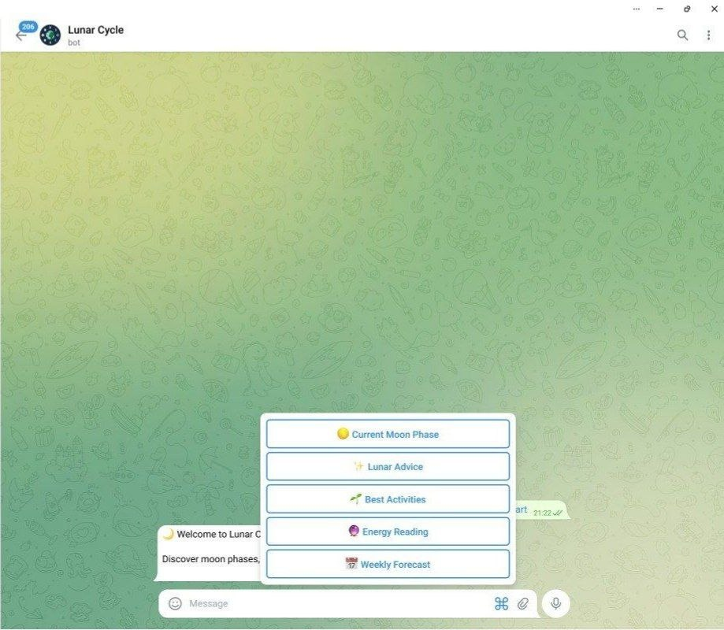
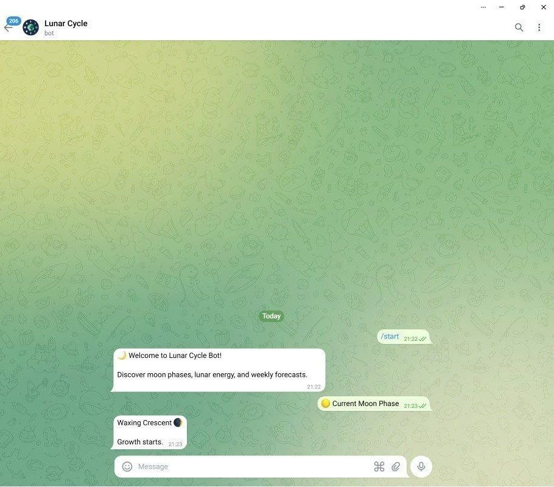
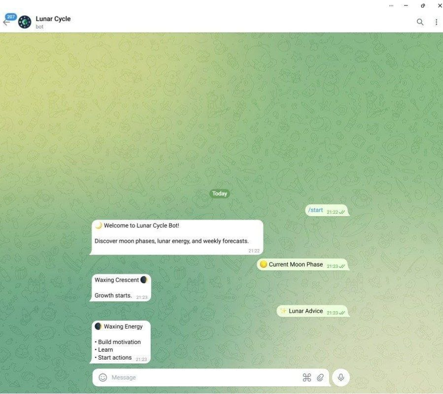
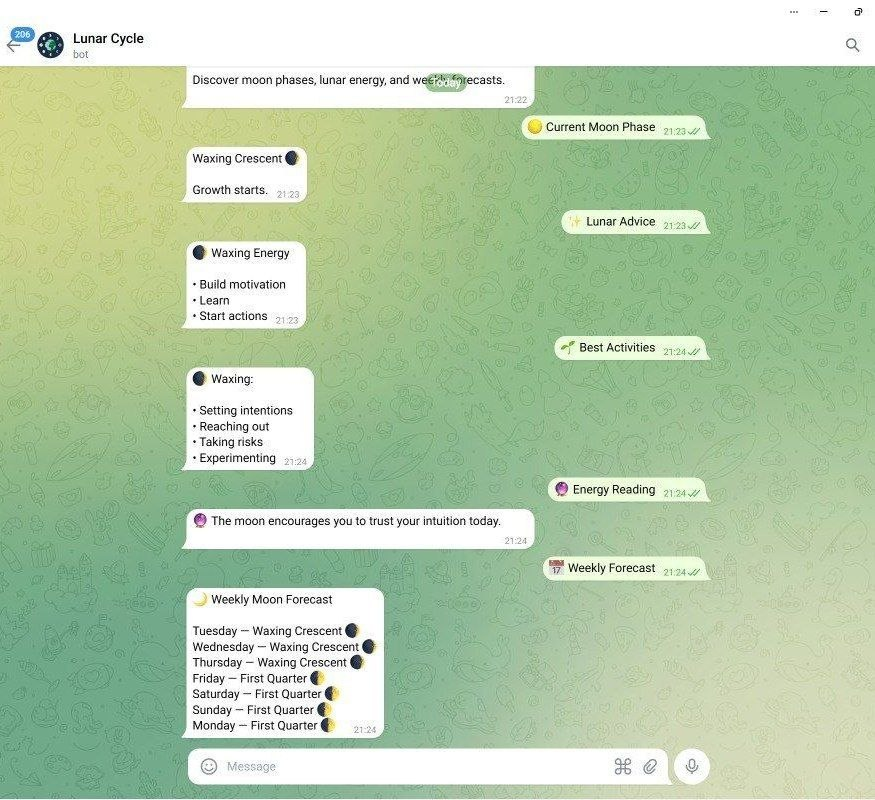

# 🌙 Lunar Cycle Bot

## Author
Diana Issen

## Group 
SE - 2514

## Project Description
LunarCycle Bot is a Telegram bot that provides users with information about the current moon phase, lunar energy, and weekly moon forecasts.

## Features
- Current moon phase
- Lunar advice
- Energy reading
- Weekly moon forecast
- Best activities suggestions
- User statistics

## Technologies Used
- Python
- pyTelegramBotAPI
- ephem
- JSON

## OOP Concepts
- Classes
- Inheritance
- Polymorphism

## Installation

1. Install dependencies:

pip install -r requirements.txt

2. Run the bot:

python main.py

## Project Structure

- main.py — main bot logic
- moon_phase.py — moon calculations
- advisor.py — recommendations system
- user_manager.py — JSON user management
- keyboards.py — Telegram keyboards

## Team Member Roles

Diana Issen:
- Developed full Telegram bot system
- Implemented moon phase calculation module
- Created lunar advice and activity recommendation system
- Designed and implemented user data storage (JSON)
- Built Telegram UI (keyboards and interaction flow)
- Integrated external libraries (pyTelegramBotAPI, ephem)
- Wrote documentation and tested the project

## Screenshots

### Start

### Menu

### Moon Phase

### Advice

### Forecast

